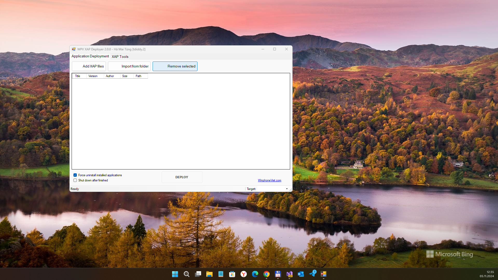

# WPVXAPDeployer v0.0.0.0 (only decompiled / draft / not ready)
My attempt to recover discontinued *WPV XAP Deployer* WPF project. via fast R.E. (decomp+some fast code refactoring).

## Screenshots

## Tech/dev details
- Platforms: WPF
- Targets: x86 or x64 (anyCPU)
- .NET Framwork 4.8
- Supported OS: Windows 10/11 

## Status
- Draft. Prototype / Alpha version.
- Smart.Device.Connectivity feature damaged (some WindowsPhone 8/8.1 system dlls not found?) 

## Credits / References
- http://winphoneviet.com (Obsolete link to original WPV XAP Deployer)
- https://answers.microsoft.com/en-us/windows/forum/all/app-not-runing-on-windows-10-wpv-xap-deployer/84c9e5b4-dc0f-40f6-b147-0e47b714a7cd
- https://smart-softwaressrrepositoryo.blogspot.com/2019/12/wpv-xap-deployerexe-download-free.html
- https://stackoverflow.com/questions/19569770/microsoft-smartdevice-connectivity-and-windows-phone-8-launch-native-apps-send
- https://csharp.hotexamples.com/examples/Microsoft.SmartDevice.Connectivity/Device/-/php-device-class-examples.html
- https://learn.microsoft.com/en-us/previous-versions/visualstudio/visual-studio-2008/bb545992(v=vs.90) (EN)
- https://learn.microsoft.com/ru-ru/previous-versions/visualstudio/visual-studio-2008/bb384093(v=vs.90) (RU)
- https://androidfilehost.com/?fid=17248734326145720581

## Licensing
MIT License

## ..
AS IS. No support. RnD only / DIY

## .
[m][e] 2024
